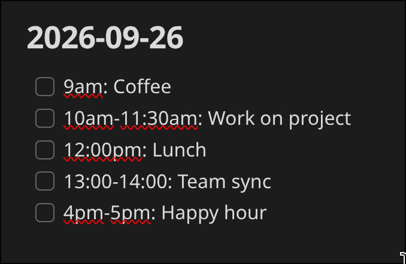
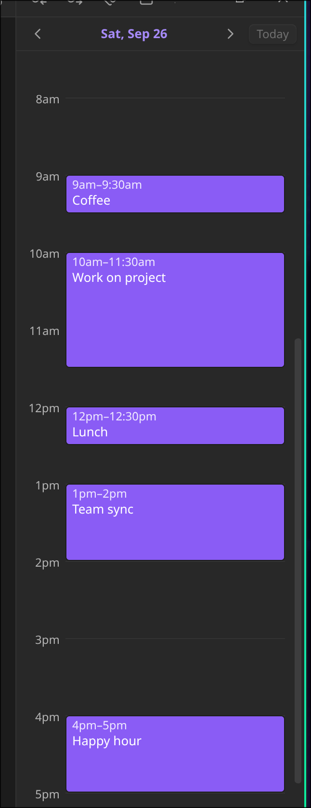

# Obsidian Day View

Sidebar timeline built from the timed top-level checkboxes in daily notes.

## Pre-requisites

You must be using the **Daily notes** core Obsidian plugin for this to work properly as we pull some information from the config of that core plugin.

## Usage

Use the **Day View: Open timeline** command to open the timeline--this should show up in the right sidebar by default. Once you have the timeline open, simply open a daily note, add content in, and the items will appear in the timeline! See the example below for some formats of times that are accepted (and what the timeline looks like):

### Other functionality

- Task items that are not top-level tasks with a valid timestamp/time range will not be included in the timeline
- You can adjust the timeline zoom and default task time (task without end time) in the settings
